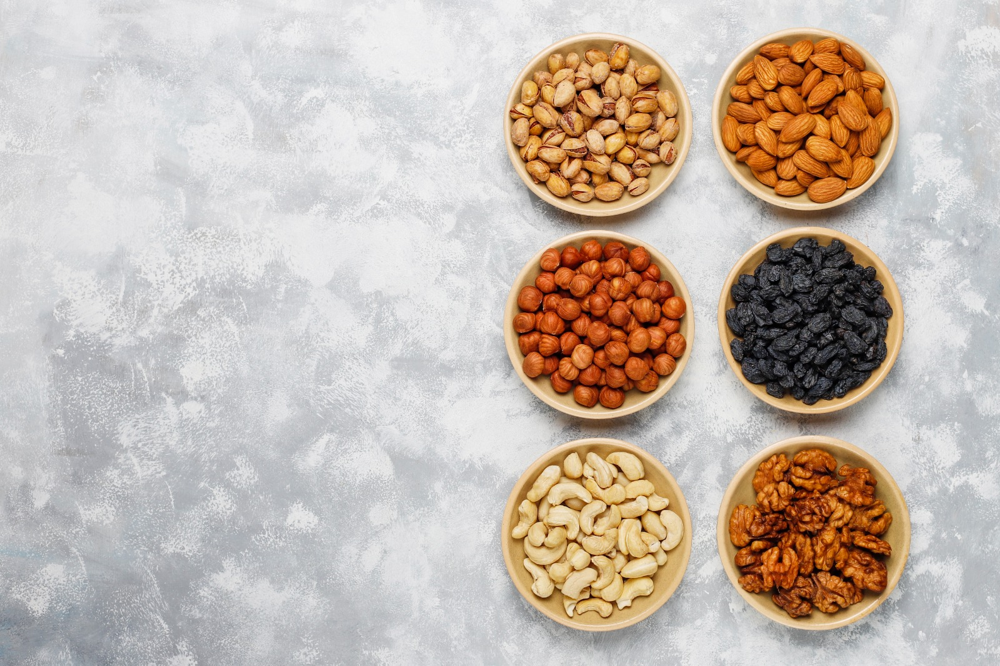
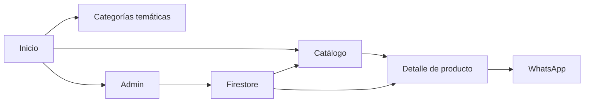
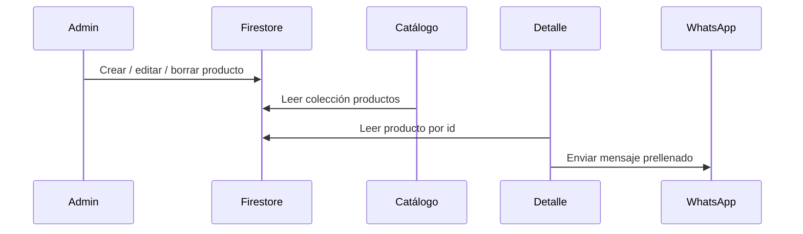

# Valle Natural

<p align="center">
  
</p>

<p align="center">
  <b>Tienda web de productos naturales</b> · Catálogo visual · Detalle dinámico · Panel admin · WhatsApp · Firestore
</p>

<p align="center">
  <a href="./docs/context.md"><strong>📘 Ver documentación completa</strong></a> ·
  <a href="./pages/productos.html"><strong>🛍️ Ir al catálogo</strong></a> ·
  <a href="./admin.html"><strong>🛠️ Abrir admin</strong></a>
</p>

---

## ✨ Resumen

Valle Natural es un sitio web multiarchivo construido con HTML, CSS y JavaScript. Funciona como catálogo comercial para productos naturales, superalimentos, frutos secos, aceites, suplementos e infusiones.

La experiencia está pensada para vender rápido:
- navegación visual;
- filtros por categoría;
- búsqueda instantánea;
- detalle individual de producto;
- contacto por WhatsApp;
- administración simple con Firestore.

---

## 🧭 Mapa Rápido



---

## 🧩 Estructura

```text
/
├─ index.html
├─ admin.html
├─ assets/
│  ├─ css/style.css
│  └─ js/
│     ├─ firebase.js
│     ├─ products-store.js
│     └─ site-utils.js
├─ docs/
│  ├─ context.md
│  ├─ datosValleNatural.txt
│  ├─ implementacion.md
│  └─ export_datosValleNatural.ps1
├─ pages/
│  ├─ productos.html
│  ├─ detalle-producto.html
│  ├─ antiinflamatorio.html
│  ├─ articulaciones.html
│  └─ ...
└─ img/
   └─ ...
```

---

## 🚀 Páginas clave

| Página | Qué hace |
|---|---|
| `index.html` | Home comercial con hero, ofertas, carrusel y navegación |
| `pages/productos.html` | Catálogo principal con filtros, buscador y cards |
| `pages/detalle-producto.html` | Vista dinámica de un producto por `?id=` |
| `admin.html` | Alta, edición y eliminación de productos |

---

## 🧠 Lógica compartida

| Archivo | Responsabilidad |
|---|---|
| `assets/css/style.css` | Estilos globales y base visual del sitio |
| `assets/js/firebase.js` | Conexión con Firebase / Firestore |
| `assets/js/products-store.js` | Productos locales y categorías |
| `assets/js/site-utils.js` | Utilidades compartidas: escapar texto, WhatsApp, categorías |

---

## 🔥 Flujo de datos



---

## 🎨 Identidad visual

- Paleta principal: verde natural + naranja cálido
- Tipografía principal: `Poppins`
- Soporte visual: Material Icons + Font Awesome
- Animación: GSAP y ScrollTrigger
- Estética: comercial, fresca y orientada a bienestar

---

## 🗂️ Convenciones

- Los HTML viven dentro de `pages/`
- Los nombres de archivo usan minúsculas y guiones
- Las categorías se manejan desde `assets/js/products-store.js`
- Los productos del admin se guardan en Firestore
- El login del admin usa `localStorage`
- La compra o consulta finaliza por WhatsApp

---

## 🗃️ Datos del proyecto

- Colección principal Firestore: `productos`
- Clave local del admin: `vn_admin_logged`
- Clave local de productos: `vn_products_v1`
- Documento de contexto: [`docs/context.md`](./docs/context.md)
- Volcado estructurado: [`docs/datosValleNatural.txt`](./docs/datosValleNatural.txt)

---

## 📚 Documentación completa

- [Contexto completo del proyecto](./docs/context.md)
- [Plan de implementación](./docs/implementacion.md)
- [Volcado estructurado del contenido](./docs/datosValleNatural.txt)

---

## ⚠️ Notas importantes

- El admin no usa autenticación real, solo una contraseña de frontend.
- Hay mezcla de contenido estático y contenido remoto desde Firestore.
- El sitio sigue siendo multiarchivo, no SPA.
- Las imágenes Base64 en Firestore facilitan pruebas, pero no escalan bien.

---

## 📌 Estado actual

El proyecto ya funciona como:
- tienda visual;
- catálogo navegable;
- detalle dinámico de producto;
- mini panel administrativo;
- canal de venta por WhatsApp.

Si quieres seguir, el siguiente salto natural es:
1. Componentizar header/footer.
2. Unificar slugs y datos de catálogo.
3. Migrar a una arquitectura más modular.
