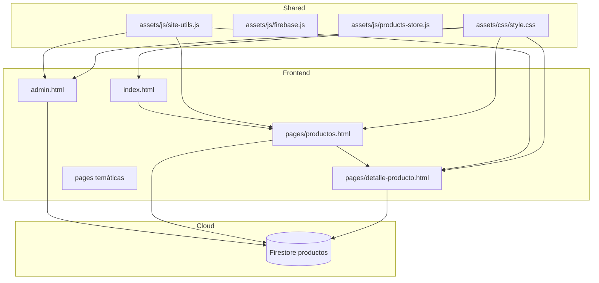
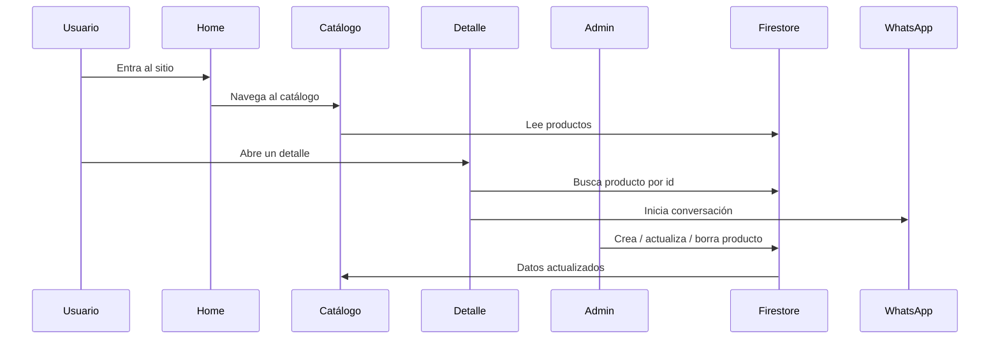

# 📘 Contexto Maestro del Proyecto Valle Natural

> Documento central del sistema. Aquí vive la visión general, arquitectura, flujo de datos, catálogos, decisiones técnicas y pendientes de evolución.

<p align="center">
  
</p>

---

## 1. 🌿 Resumen Ejecutivo

Valle Natural es una tienda web de productos naturales construida como una aplicación web estática con mucho contenido comercial y cierto nivel de dinamismo.

Su propuesta combina:
- catálogo visual;
- páginas temáticas por beneficio o tipo de producto;
- detalle de producto por `id`;
- administración de productos con Firestore;
- comunicación comercial por WhatsApp;
- animaciones y componentes visuales para reforzar conversión.

El objetivo del proyecto es vender y presentar productos naturales de forma atractiva, simple y confiable.

---

## 2. 🧱 Arquitectura General



---

## 3. 🛠️ Stack Tecnológico

### Frontend
- HTML5
- CSS3
- JavaScript
- Tailwind CDN
- GSAP
- ScrollTrigger
- Google Fonts `Poppins`
- Material Icons
- Font Awesome

### Persistencia
- Firebase v12.7.0
- Cloud Firestore
- `localStorage`

### Automatización
- PowerShell
- Script de exportación de contenido
- Documentación estructurada en `docs/`

---

## 4. 📁 Estructura del Repositorio

```text
/
├─ index.html
├─ admin.html
├─ assets/
│  ├─ css/style.css
│  └─ js/
│     ├─ firebase.js
│     ├─ products-store.js
│     └─ site-utils.js
├─ docs/
│  ├─ context.md
│  ├─ datosValleNatural.txt
│  ├─ implementacion.md
│  └─ export_datosValleNatural.ps1
├─ pages/
│  ├─ productos.html
│  ├─ detalle-producto.html
│  ├─ antiinflamatorio.html
│  ├─ articulaciones.html
│  ├─ energia.html
│  └─ ...
└─ img/
   └─ ...
```

### Observación
La carpeta `pages/` contiene la mayoría de las vistas del sitio. Los nombres ya siguen una convención uniforme:
- minúsculas;
- sin acentos;
- con guiones;
- orientadas a URL limpias.

---

## 5. 🧭 Páginas principales

### `index.html`
La home principal. Presenta:
- barra informativa;
- header sticky;
- buscador;
- carrusel hero;
- ofertas destacadas;
- categorías;
- productos promocionados;
- acceso a páginas temáticas;
- enlaces a WhatsApp.

### `pages/productos.html`
Catálogo general del sitio.

Incluye:
- cards estáticas y dinámicas;
- buscador;
- chips por categoría;
- filtros por oferta y stock;
- integración con Firestore;
- accesos al detalle.

### `pages/detalle-producto.html`
Vista de detalle de un producto individual.

Realiza:
- lectura de `?id=` desde la URL;
- consulta a Firestore;
- renderizado de información del producto;
- carga de productos relacionados;
- armado de mensaje personalizado para WhatsApp.

### `admin.html`
Panel administrativo básico.

Permite:
- iniciar sesión con contraseña fija;
- crear producto;
- editar producto;
- eliminar producto;
- borrar toda la colección;
- trabajar con imágenes en Base64.

---

## 6. 🎛️ Componentes compartidos

### `assets/css/style.css`
Contiene la base visual global:
- colores;
- tipografía;
- header;
- navbar;
- hero;
- cards;
- botones;
- footer;
- estilos responsivos.

### `assets/js/firebase.js`
Centraliza la configuración de Firebase y los helpers de Firestore.

Exporta:
- `app`
- `db`
- `productosRef`
- `collection`
- `doc`
- `getDocs`
- `getDoc`
- `addDoc`
- `deleteDoc`
- `updateDoc`
- `serverTimestamp`
- `query`
- `orderBy`

### `assets/js/products-store.js`
Gestiona productos locales y categorías de administración.

### `assets/js/site-utils.js`
Unifica funciones repetidas:
- `escapeHtml()`
- `toNumberSafe()`
- `buildWhatsAppUrl()`
- `prettyCategory()`

Esto ayuda a evitar duplicación entre páginas.

---

## 7. 🔁 Flujo Funcional



### Flujo comercial
1. El usuario entra por `index.html`.
2. Explora el catálogo o una landing temática.
3. Abre el detalle de un producto.
4. Elige presentación.
5. Se abre WhatsApp con mensaje precargado.

### Flujo administrativo
1. El admin accede a `admin.html`.
2. Se autentica con contraseña de frontend.
3. Crea o edita productos.
4. Los datos viajan a Firestore.
5. El catálogo y el detalle los consumen.

---

## 8. 🧬 Modelo de datos

### Producto Firestore
Campos observados:
- `nombre`
- `precio`
- `categoria`
- `descripcion`
- `imagen`
- `stock`
- `offer`
- `createdAt`
- `presentacion` o `presentaciones`

### Notas de implementación
- `imagen` puede venir como URL o Base64.
- `stock` y `offer` se usan como indicadores de estado.
- `categoria` se usa tanto para filtros como para la ficha técnica.

---

## 9. 🏷️ Categorías de negocio

Categorías vigentes en el proyecto:
- `frutos_secos`
- `semillas`
- `endulzantes_infusiones`
- `superfoods_suplementos`
- `colageno`
- `vitaminas-suplementos`
- `medicinales`
- `granos_pops`
- `snacks`
- `aceites`

### Mapeo conceptual
- Frutos secos y snacks: energía rápida y consumo diario
- Superfoods: productos funcionales y de bienestar
- Medicinales: plantas, extractos e infusiones
- Aceites: cocina y cuidado personal
- Colágeno y suplementos: soporte articular, belleza y salud

---

## 10. 🖼️ Catálogo y páginas temáticas

El proyecto incluye muchas páginas de enfoque editorial o categoría.

Ejemplos:
- `pages/adulto-mayor.html`
- `pages/antiinflamatorio.html`
- `pages/articulaciones.html`
- `pages/defensas-naturales.html`
- `pages/digestion.html`
- `pages/energia.html`
- `pages/movimiento.html`

Y páginas de producto:
- `pages/aceite-coco.html`
- `pages/aceite-oliva.html`
- `pages/almendras-naturales.html`
- `pages/castanas.html`
- `pages/chia.html`
- `pages/colageno-hidrolizado.html`
- `pages/maca-negra.html`
- `pages/miel-abeja.html`
- `pages/moringa.html`
- `pages/polen-abeja.html`
- `pages/quinua.html`

---

## 11. 🎨 Identidad visual

El sistema visual está inspirado en:
- colores tierra y naturaleza;
- contraste verde/naranja;
- tarjetas limpias y comerciales;
- jerarquía tipográfica fuerte;
- imágenes de producto como foco central.

### Recursos visuales frecuentes
- fondos con gradientes suaves;
- banners de categoría;
- botones redondeados;
- sombras suaves;
- animaciones de entrada con GSAP.

---

## 12. 📦 Automatización y documentación

### `docs/export_datosValleNatural.ps1`
Script que extrae el contenido visible del proyecto y genera `docs/datosValleNatural.txt`.

### `docs/datosValleNatural.txt`
Inventario estructurado del contenido HTML del sitio.

### `docs/implementacion.md`
Plan histórico de migración a Angular.

### `README.md`
Portada ejecutiva del proyecto.

---

## 13. ⚠️ Riesgos y observaciones

- El login del admin no es seguro para producción.
- Firestore y `localStorage` conviven como fuentes de datos.
- Hay mucho contenido duplicado en páginas temáticas.
- Algunas páginas todavía replican header/footer.
- Las imágenes Base64 pueden crecer demasiado si el catálogo escala.
- El sitio sigue siendo multiarchivo, no SPA.

---

## 14. 🔮 Oportunidad de mejora

Si se quisiera evolucionar este proyecto, el siguiente paso sería:

1. Crear componentes reutilizables de header y footer.
2. Unificar la fuente de verdad del catálogo.
3. Estandarizar todas las landing pages por plantilla.
4. Separar aún más presentación, lógica y datos.
5. Migrar a un framework con routing si el catálogo sigue creciendo.

---

## 15. 📍 Estado actual

Hoy Valle Natural ya opera como:
- vitrina comercial;
- catálogo navegable;
- sistema de detalle por producto;
- panel simple de administración;
- sistema de contacto directo por WhatsApp.

Es una base funcional, visual y escalable, aunque todavía con margen claro para refinar arquitectura y mantenimiento.
